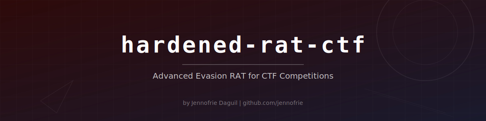

<p align="center">
  
</p>

<p align="center">
  
  
  
  
  
</p>

<h3 align="center">Advanced Evasion RAT for CTF Competitions</h3>

<p align="center">
  A hardened Windows Remote Access Tool written in Rust, featuring compile-time string obfuscation, dynamic API resolution, hybrid encryption, anti-debugging, anti-VM, anti-sandbox techniques, and a thread-safe keylogger — designed exclusively for Capture The Flag competitions and security research.
</p>

---

> [!WARNING]
> **This tool is intended for CTF competitions, authorised security research, and educational purposes ONLY.**
> Deploying this software against systems you do not own or have explicit written permission to test is **illegal** and **unethical**. The author assumes no liability for misuse. Use responsibly within the bounds of applicable law.

---

## Feature Matrix

| Category | Feature | Description |
|----------|---------|-------------|
| **Obfuscation** | Compile-time XOR strings | `obfuscate!()` macro encrypts all string literals at compile time |
| **Obfuscation** | Dynamic API resolution | Win32 APIs resolved via `GetProcAddress` at runtime — no static imports |
| **Encryption** | RC4 transport layer | Stream cipher for low-overhead network framing |
| **Encryption** | AES-128-CTR payload | Strong symmetric encryption with random nonce per message |
| **Encryption** | Hybrid scheme | RC4 wraps AES-CTR — two layers of encryption on every C2 message |
| **Anti-Debug** | `IsDebuggerPresent` | Standard WinAPI debugger check |
| **Anti-Debug** | `CheckRemoteDebuggerPresent` | Detects remote debuggers |
| **Anti-Debug** | `NtQueryInformationProcess` | ProcessDebugPort check via dynamically resolved ntdll |
| **Anti-VM** | Registry fingerprinting | Checks SCSI identifiers for VBOX, VMware, QEMU strings |
| **Anti-VM** | Resource checks | Flags systems with < 2 CPU cores or < 2 GB RAM |
| **Anti-Sandbox** | Uptime check | Detects environments with < 10 min uptime |
| **Anti-Sandbox** | Sleep acceleration | Detects sandboxes that fast-forward `Sleep()` calls |
| **Persistence** | Registry Run key | Adds to `HKCU\...\Run` using dynamically resolved registry APIs |
| **Keylogger** | Thread-safe capture | Captures keystrokes with window title tracking |
| **Keylogger** | Encrypted buffer | Mutex-protected 1 MiB ring buffer |
| **C2** | Session management | Server supports multiple simultaneous implant connections |
| **C2** | Jittered beaconing | Configurable base delay + random jitter to avoid pattern detection |
| **Build** | Cross-compile stubs | `cargo check` passes on macOS/Linux via `#[cfg(target_os)]` |

## Evasion Techniques

```
1. String Obfuscation        XOR at compile time, decrypt at runtime only when needed
2. Import Table Hiding       No static Win32 imports — all resolved via GetProcAddress
3. Dual-Layer Encryption     RC4 transport + AES-128-CTR payload on every C2 message
4. Anti-Debug (3 methods)    IsDebuggerPresent + Remote check + NtQuery ProcessDebugPort
5. Anti-VM                   Registry SCSI fingerprints + resource (CPU/RAM) thresholds
6. Anti-Sandbox              Uptime gating + Sleep() acceleration detection
7. Jittered Beacon           Randomised reconnect intervals to defeat traffic analysis
8. Legitimate-Looking Keys   Persistence registry values mimic Windows system services
```

## Quick Start

### Prerequisites

- [Rust toolchain](https://rustup.rs/) (1.70+)
- For Windows builds: `x86_64-pc-windows-gnu` or `x86_64-pc-windows-msvc` target

### Build the C2 Server (runs anywhere)

```bash
cargo build --release -p rat-server
```

### Build the Implant (Windows target)

```bash
# On Windows
cargo build --release -p rat-implant

# Cross-compile from macOS/Linux (requires mingw-w64)
rustup target add x86_64-pc-windows-gnu
cargo build --release -p rat-implant --target x86_64-pc-windows-gnu
```

### Run

```bash
# Start the C2 server
./target/release/rat-server [port] [bind_address]
# Default: 0.0.0.0:50005

# Deploy the implant on the target Windows machine
# It will beacon back to the configured C2 IP
```

### C2 Server Commands

```
sessions / list      List all connected implants
interact <id>        Enter interactive shell with an implant
kill <id>            Terminate a session
quit / exit          Shut down the server
```

### Implant Shell Commands

```
cd <path>            Change directory on the target
persist              Install registry persistence
keylog_start         Start the keylogger thread
keylog_stop          Stop the keylogger thread
keylog_dump          Retrieve captured keystrokes
exit / q             Disconnect the implant
<any command>        Execute via cmd.exe /C on the target
```

## Architecture

```
hardened-rat-ctf/
├── Cargo.toml                 # Workspace root
├── rat-common/                # Shared library
│   └── src/
│       ├── lib.rs             # Public API
│       ├── crypto.rs          # RC4, AES-CTR, HybridCipher
│       ├── obfuscation.rs     # XOR obfuscation + obfuscate!() macro
│       └── protocol.rs        # Length-prefixed framed I/O
├── rat-implant/               # Windows RAT binary
│   └── src/
│       ├── main.rs            # Entry point + anti-analysis gate
│       ├── config.rs          # Runtime config (keys, beacon interval)
│       ├── dynapi.rs          # Dynamic Win32 API resolution
│       ├── anti_analysis.rs   # Debugger, VM, sandbox checks
│       ├── keylogger.rs       # Thread-safe keystroke capture
│       ├── persistence.rs     # Registry Run key persistence
│       ├── network.rs         # C2 TCP connection + encryption
│       └── shell.rs           # Command dispatcher
├── rat-server/                # C2 server binary
│   └── src/
│       ├── main.rs            # Listener + operator console
│       └── session.rs         # Multi-session management
├── assets/
│   └── banner.svg             # Project banner
├── CLAUDE.md                  # AI assistant context
├── README.md                  # This file
└── LICENSE                    # MIT
```

### Communication Flow

```
┌──────────────┐         ┌──────────────────────────────────┐         ┌──────────────┐
│              │         │      Wire Format (per msg)       │         │              │
│   Implant    │◄───────►│ [4B len] [RC4(AES-CTR(payload))] │◄───────►│  C2 Server   │
│              │         │                                  │         │              │
│  - Beacon    │         │  1. Plaintext                    │         │  - Listener  │
│  - Shell     │         │  2. AES-128-CTR + random nonce   │         │  - Sessions  │
│  - Keylogger │         │  3. RC4 transport wrap           │         │  - Console   │
│  - Persist   │         │  4. Length-prefix frame           │         │              │
└──────────────┘         └──────────────────────────────────┘         └──────────────┘
```

## Configuration

Key configuration lives in `rat-implant/src/config.rs`:

| Parameter | Default | Description |
|-----------|---------|-------------|
| `c2_ip` | `192.168.20.52` | C2 server IP (XOR-obfuscated at compile time) |
| `c2_port` | `50005` | C2 server port |
| `rc4_key` | `MySecretKey2024!` | RC4 transport encryption key |
| `aes_key` | `AES128CTFKey2024` | AES-128-CTR payload encryption key |
| `reconnect_delay_ms` | `60000` | Base beacon interval (ms) |
| `reconnect_jitter_ms` | `15000` | Jitter range (+/- ms) |
| `max_connect_attempts` | `5` | Retry count before long sleep |

**Change these values before deploying in a CTF environment.**

## Detection Notes

This implant is designed to evade basic static and dynamic analysis. For blue team / detection engineering practice:

- **Sigma rules**: Look for `cmd.exe` child processes spawned by unsigned executables
- **YARA**: Target the RC4 KSA pattern or AES S-box constants in memory
- **Network**: Beacon intervals with jitter produce detectable periodicity over time
- **Registry**: Monitor `HKCU\...\CurrentVersion\Run` for new entries
- **Behaviour**: `GetAsyncKeyState` polling at 10ms intervals is a strong keylogger indicator
- **Memory forensics**: The 1 MiB keylog buffer persists in process memory

## Legal

This project is provided under the [MIT License](LICENSE). It is intended **solely** for:

- Capture The Flag (CTF) competitions
- Authorised penetration testing engagements
- Academic security research
- Malware analysis training

**Unauthorised use against systems you do not own or have permission to test is a criminal offence in most jurisdictions.** The author disclaims all liability for misuse.

## Author

**Jennofrie Daguil**

---

<p align="center">
  <sub>Built with Rust for safety, speed, and stealth.</sub>
</p>
